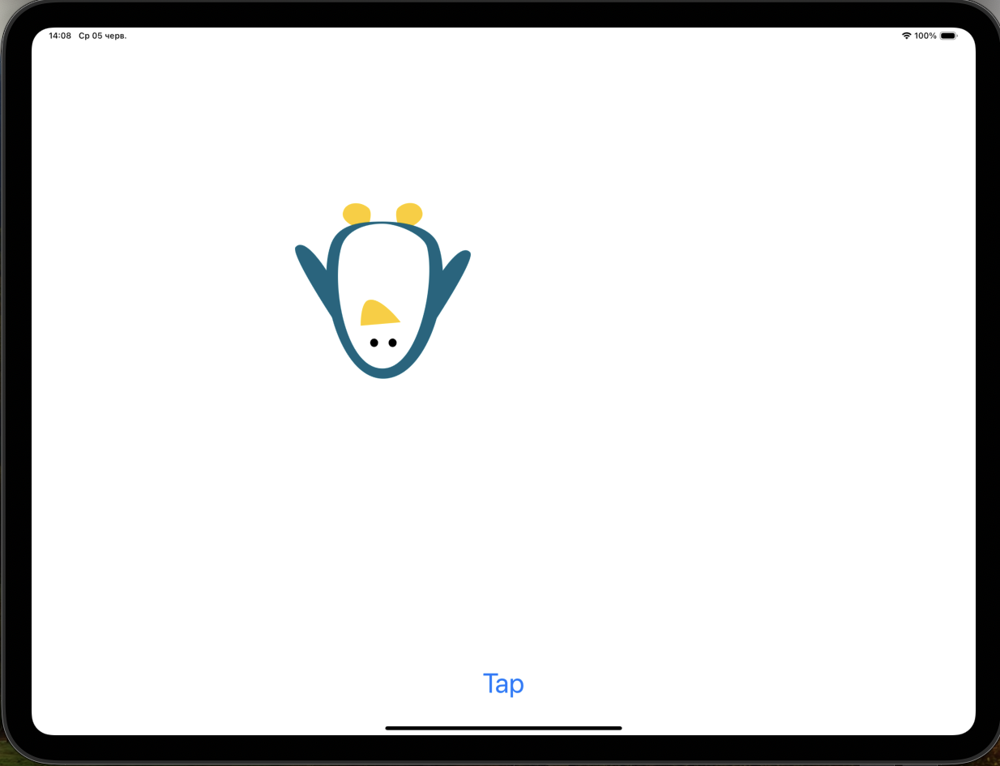
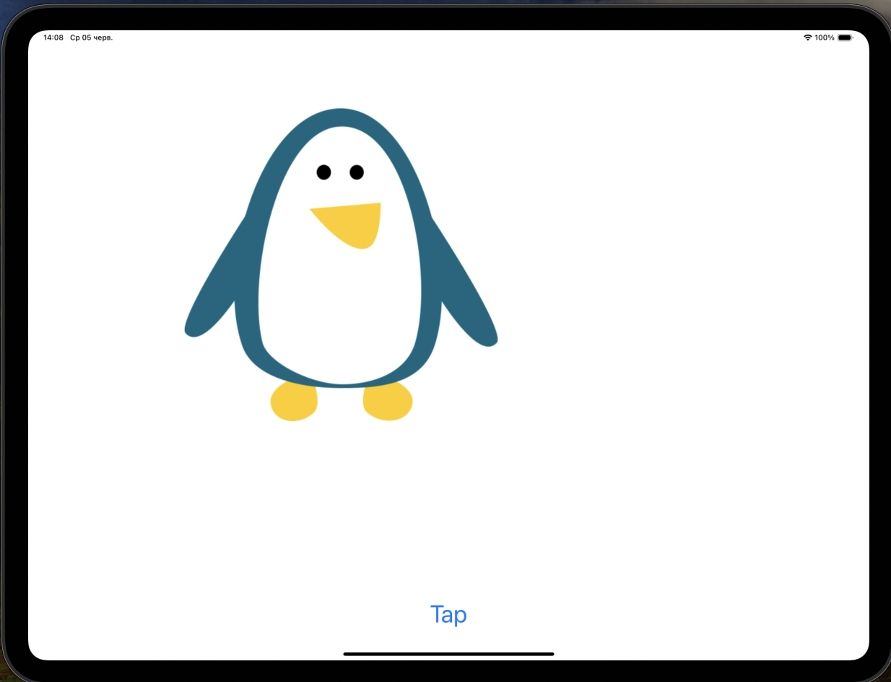

# Project15 Animation

This is an iOS app that demonstrates various UIKit animations on a single image view. The user can apply different transformations to the image, such as scaling, translation, rotation, and changing opacity and background color.

## Features

* Scale the image
* Translate the image
* Rotate the image
* Change the opacity and background color of the image
* Reset transformations to the original state
* Smooth animations with spring damping and initial velocity

## Screenshots

  

  

## Animation Steps

1. Scale the image to twice its size
2. Reset the image to its original size
3. Translate the image by (-256, -256) points
4. Reset the image to its original position
5. Rotate the image by 180 degrees (π radians)
6. Reset the image rotation
7. Change the image opacity to 10% and background color to green
8. Reset the image opacity and background color

## Controls

* Tap the button to cycle through the animations

## Technical Requirements

* iOS 12.0+
* Xcode 12.0+
* Swift 5.0+

## Possible Development

* Add more complex animations
* Introduce interactive animations controlled by gestures
* Add sound effects for each animation
* Implement a sequence of animations that play automatically
